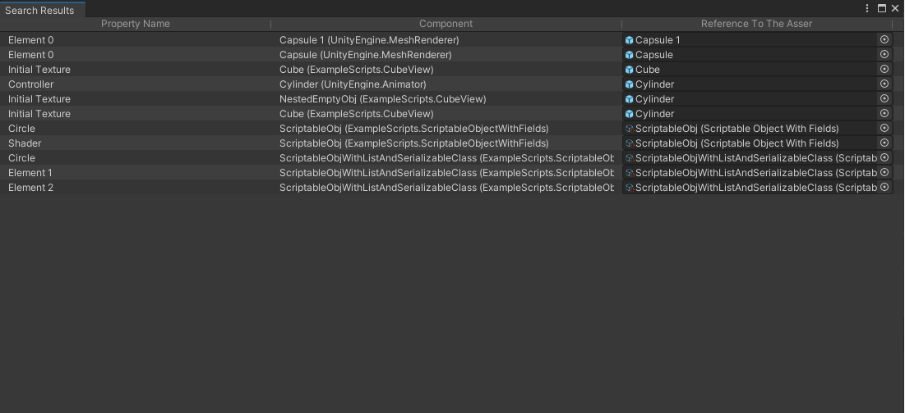

# MissingReferencesSearch
This is a tool for missing references searching in all assets (including it's child objects and scriptable objects) in Assets/. 

## How it works
Missing references can happen for the following reasons:
- asset was was renamed or moved to another folder outside of the editor without the same changes to it's .meta file
- asset's .meta file was renamed or moved to another folder outside of the editor without the same changes to it's asset
- asset was deleted
- asset's .meta was deleted

So, according to Unity's article "Assets, Resources and AssetBundles":
> All UnityEngine.Objects can have references to other UnityEngine.Objects. 
> These other Objects may reside within the same Asset file, or may be imported from other Asset files.
> When serialized, references consist of two separate pieces of data: a File GUID and a Local ID. 
> The File GUID identifies the Asset file where the target resource is stored. A locally unique Local ID 
> identifies each Object within an Asset file because an Asset file may contain multiple Objects. 
> (Note: AA Local ID is unique from all the other Local IDs for the same Asset file.)

Once we created a reference to the actual object, {fileID:, guid:} will be set to the property (it can be
simply a fileID when the object being referenced lives within the same file).
Because GUID comparisons are slow and a more performant system is needed at runtime, Unity internally 
maintains a cache that translates File GUIDs and Local IDs into simple, session-unique integers. 
These integers are called Instance IDs, and are assigned in a simple, monotonically-increasing order when 
new Objects are registered with the cache.
So the actual goal is to check if reference value's InstanceID is equals to 0 or not. This is the only one solution i've found.

# Ho To Use
Go to Tools/Missing References Search Tool, then press "Search For Missing References" button.

After tool has finished searching "Search Results" window will appear, which contains property name, 
component and reference to the asset. You can click on component to see object in the inspector window. 
Clicking on reference will navigate to the asset in the project tab.

